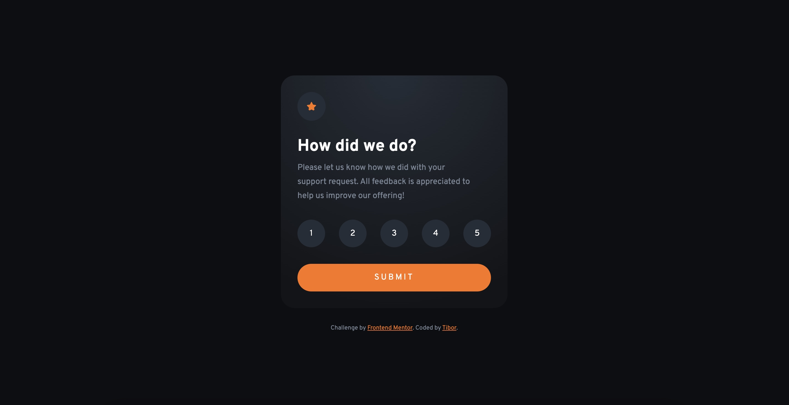

# Frontend Mentor - Interactive rating component

## Hello

I'm a designer learning to code. I spent way too much time making this look like the figma file. :) At the same time I'm happy I managed to get a very lean javascript solution working.

Questions I had while working on this project:
- Is the my js solutions working well?
- Is normalize.css still needed or used, or do we have better alternatives?
- I repurposed a form with radiobuttons, is that a good practice from an accessibility pov?

# Frontend Mentor - Interactive rating component solution

This is a solution to the [Interactive rating component challenge on Frontend Mentor](https://www.frontendmentor.io/challenges/interactive-rating-component-koxpeBUmI).

## Table of contents

- [Overview](#overview)
  - [The challenge](#the-challenge)
  - [Screenshot](#screenshot)
  - [Links](#links)
- [My process](#my-process)
  - [Built with](#built-with)
  - [What I learned](#what-i-learned)
  - [Continued development](#continued-development)
- [Author](#author)

## Overview

### The challenge

Users should be able to:

- View the optimal layout for the app depending on their device's screen size
- See hover states for all interactive elements on the page
- Select and submit a number rating
- See the "Thank you" card state after submitting a rating

### Screenshot

### Links

- Solution URL: [Github repo link](https://github.com/tibormiklos/fm-1/)
- Live Site URL: [Github pages link](https://tibormiklos.github.io/fm-1/)

### Built with

- Semantic HTML5 markup
- CSS variables
- Flexbox
– Normalize.css

### What I learned

I learnt how to make a radial gradient background using css. I learnt about using the 'querySelector' function in javascript.

### Continued development

I need to focus on more javascript and generally learning the ropes using github, frameworks and organising my work. 

## Author

- Frontend Mentor - [@tibormiklos](https://www.frontendmentor.io/profile/tibormiklos)
